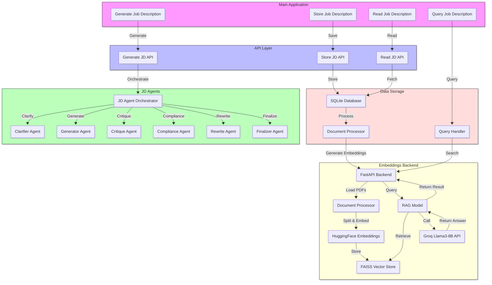

# AI Job Description Manager

An AI-powered system to generate, refine, store, and semantically search job descriptions using a multi-agent architecture with vector-based retrieval.

---

## System Architecture

## Components

### Job Descriptions Experts Portal
- **Generate Job Description:** Start new JD creation
- **Store Job Description:** Save JDs to storage
- **Read Job Description:** Retrieve stored JDs
- **Query Job Description:** Semantic search through JDs

### Agentic JD Generator APIs
- **Generate JD API:** Triggers JD agent orchestration
- **Store JD API:** Persists JDs to the database
- **Read JD API:** Retrieves stored JDs

### JD Agents
- **JD Agent Orchestrator:** Manages the workflow between agents
- **Clarifier Agent:** Clarifies ambiguous input
- **Generator Agent:** Creates initial draft
- **Critique Agent:** Reviews and suggests improvements
- **Compliance Agent:** Validates against compliance standards
- **Rewrite Agent:** Improves flow and style
- **Finalizer Agent:** Prepares JD for final storage

### Storage and Query
- **SQL Lite Database:** Structured storage for JDs
- **Document Processor:** Creates embeddings for JDs
- **VectorDB:** Stores embeddings for semantic query
- **Query Handler:** Processes user queries and retrieves matches

### External Systems
- **LLM Embeddings Generator:** Generates vector embeddings 

---

## Features

- Multi-agent job description generation pipeline
- Embeddings-based semantic search
- CQRS (Command Query Responsibility Separation) based architecture
- Compliance, Critique, and Rewrite workflow
- Easy API-based integrations
- Modular and extensible design

---

## Tech Stack

- .NET 8 / ASP.NET Core Web API
- SQLite
- FAISS or Chroma for vector storage
- LLM services for embeddings (OpenAI / Huggingface)
- Docker (for local development)

---

