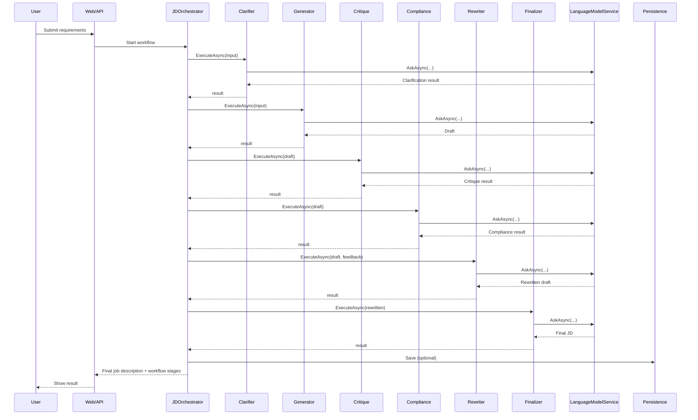

# System Design Document: Agentic Job Description Generator

## Goal

To provide an AI-powered platform that generates professional, inclusive, and compliant job descriptions using a multi-agent workflow, with a modern, maintainable, and extensible architecture.

## Design Principles / Tenets

- **Separation of Concerns:** Use CQRS to separate read and write operations for maintainability and scalability.
- **Extensibility:** Modular agent-based workflow allows easy addition of new processing steps or agents.
- **Testability:** Use MediatR and dependency injection to enable unit and integration testing.
- **Transparency:** Each workflow stage is tracked and can be surfaced to the user for clarity.
- **Security:** Sensitive data (API keys) is never committed; user secrets and environment variables are used.
- **User Experience:** Provide clear feedback, error handling, and a simple UI for both API and web users.

## Workflows and Use Cases

### Main Workflow: Generate Job Description
1. **User submits requirements** via web UI or API.
2. **Clarifier Agent** checks for missing or vague information, asks for clarification or makes assumptions.
3. **Generator Agent** creates an initial draft.
4. **Critique Agent** reviews tone, clarity, and structure.
5. **Compliance Agent** checks for bias and legal compliance.
6. **Rewriter Agent** incorporates feedback and rewrites the draft.
7. **Finalizer Agent** polishes the language and flow.
8. **Result is returned** to the user and can be saved for later.

### Use Cases
- Generate a new job description from requirements
- Review and clarify vague job description requests
- Save and retrieve previously generated job descriptions
- View the workflow stages for transparency

## High Level System

- **Frontend:** Razor Pages web UI and Swagger UI for API
- **Backend:** ASP.NET Core, CQRS with MediatR, multi-agent workflow
- **Persistence:** Entity Framework Core with SQLite
- **External:** Groq/OpenAI API for language model

## Components

- **Controllers:** API endpoints for commands (write) and queries (read)
- **Commands/Queries:** MediatR handlers for all business logic
- **Agents:** Clarifier, Generator, Critique, Compliance, Rewriter, Finalizer
- **Orchestrator:** Coordinates the agent workflow
- **Persistence:** ApplicationDbContext, SavedJobDescription model
- **Configuration:** appsettings.json, user secrets

## Sequence Diagram (Mermaid)

## Next Steps

- Add more unit and integration tests for all agents and handlers
- Implement role-based access control for saved job descriptions
- Add support for additional LLM providers
- Enhance the UI for better workflow transparency
- Add monitoring/logging for agent performance and errors
- Document API endpoints and workflows in more detail 