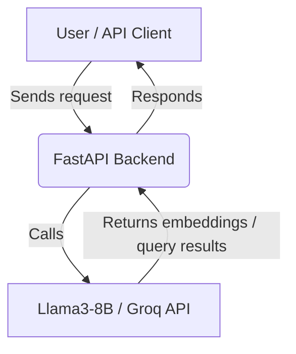

# Job Description Backend (API)

This is the backend service for the Job Description Chat system. It provides REST APIs for document embedding and querying using FastAPI using the power of **Llama3-8B** and **Groq**! 

## Features
- Generate and store embeddings for job descriptions
- Query stored embeddings with natural language
- Designed for containerized, standalone deployment

## How It Works



## Directory Structure
- `rag_app/` - Main backend application code
- `job_descriptions/` - Example job description PDFs
- `requirements.txt` - Python dependencies
- `Dockerfile` - Container build instructions

## Requirements
- Python 3.9+
- See `requirements.txt` for dependencies
- GROQ API key (see instructions below)

### Getting a GROQ API Key

1. Go to [GROQ Console](https://console.groq.com/)
2. Sign up for an account if you don't have one
3. Once logged in, navigate to the API Keys section
4. Click "Create API Key"
5. Copy the generated key and keep it secure

## Running Locally

```bash
pip install -r requirements.txt
uvicorn rag_app.api_server:app --reload --host 0.0.0.0 --port 9061
```

## Running with Docker Compose (Development with Hot Reload)

1. Clone the repository:
```bash
git clone https://github.com/akhilaraop/job-description-chat.git
cd job-description-chat
```
2. From the project directory, create a `.env` file with your GROQ API key created earlier
```bash
GROQ_API_KEY=your-api-key-here > .env

```bash
docker-compose up
```
This will mount your code and enable hot reload for development.


## API Endpoints

### `POST /api/generate_embeddings`
**Request Body:**
```json
{ "job_id": "string", "description": "string" }
```
**Response Example:**
```json
{ "status": "success", "embedding_id": "abc123" }
```

### `POST /api/query`
**Request Body:**
```json
{ "job_id": "string", "query": "string" }
```
**Response Example:**
```json
{ "result": "Relevant job description text..." }
```

